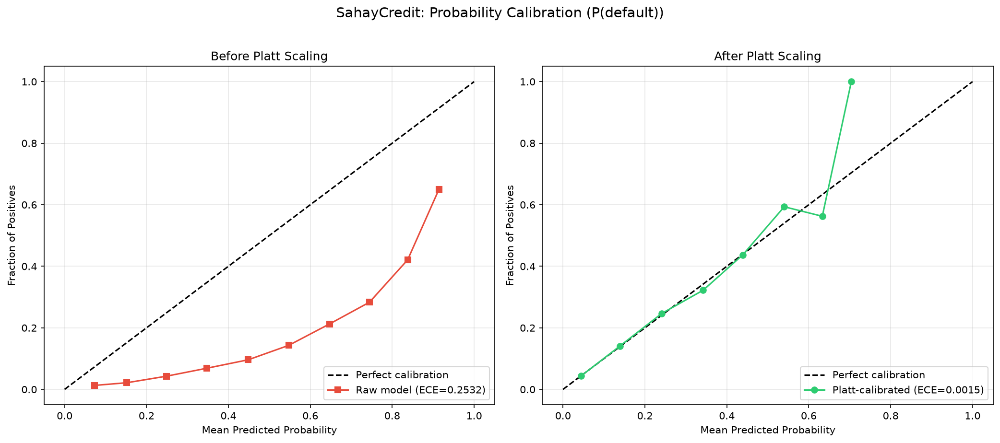
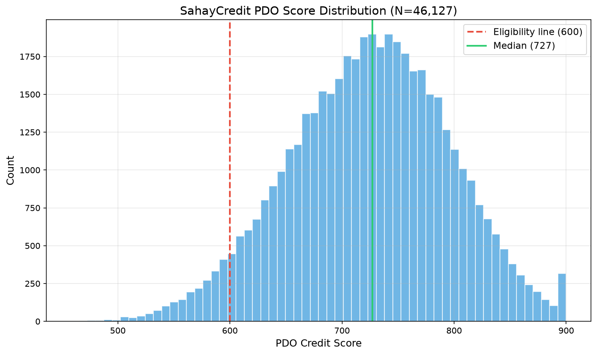

# SahayCredit — PDO Calibration Report

Generated: 2026-07-12T14:13:20.473139

## 1. Probability Recalibration (Platt Scaling)

The XGBoost model was trained with `scale_pos_weight = 7.52` to correct for
class imbalance (8.07% default rate in validation set).
This makes the raw `predict_proba` output a skewed, non-calibrated probability.

**Platt scaling** (logistic regression of true labels against raw log-odds)
was fit on the held-out validation set to produce calibrated probabilities.

| Parameter | Value |
|-----------|-------|
| Platt A (slope) | 1.015215 |
| Platt B (intercept) | -1.993002 |
| ECE before Platt | 0.2532 |
| ECE after Platt | 0.0015 |
| Validation set size | 46,127 |



## 2. PDO Score Conversion

Industry-standard Points-to-Double-Odds (PDO) methodology:
```
odds = pRepayment / pDefault
Score = Offset + Factor * ln(odds)
Factor = PDO / ln(2)
Offset = Anchor_Score - Factor * ln(Anchor_Odds)
```

### Anchor Parameters (business risk-appetite decisions, not fitted to outputs):

| Parameter | Value | Rationale |
|-----------|-------|-----------|
| Anchor Score | 600 | Industry convention |
| Anchor Odds | 3.0:1 | At score 600, accept ~25% default rate (financial inclusion product) |
| PDO | 50 | Every 50 points doubles odds; standard scorecard convention |
| Factor | 72.1348 | = PDO / ln(2) |
| Offset | 520.7519 | = AnchorScore - Factor * ln(AnchorOdds) |

## 3. Score Distribution (Validation Set)

| Statistic | Value |
|-----------|-------|
| N | 46,127 |
| Mean | 724.7 |
| Median | 727.2 |
| Std | 71.6 |
| Min | 458.3 |
| Max | 900.0 |

### Percentiles:

| Percentile | Score |
|------------|-------|
| P5 | 602.9 |
| P10 | 630.1 |
| P25 | 676.3 |
| P50 | 727.2 |
| P75 | 774.8 |
| P90 | 815.5 |
| P95 | 839.1 |

### Tier Distribution:

| Tier | Count | Percentage |
|------|-------|------------|
| A+ (>=750) | 17,299 | 37.5% |
| A (700-749) | 12,397 | 26.9% |
| B+ (650-699) | 9,357 | 20.3% |
| B (600-649) | 4,933 | 10.7% |
| C (<600) | 2,141 | 4.6% |

**Borrowers eligible (>=600): 43,986 / 46,127 (95.4%)**



## 4. Psychometric Modifier

The psychometric quiz modifier is capped at ±25 points.
It nudges within a tier but cannot single-handedly cross the 600-point
eligibility line for an otherwise-weak financial profile.

## 5. Interpretation

Under this methodology, 95.4% of the validation population
clears the 600-point eligibility line, indicating the PDO parameters and
Platt calibration produce a reasonable distribution for this product.
